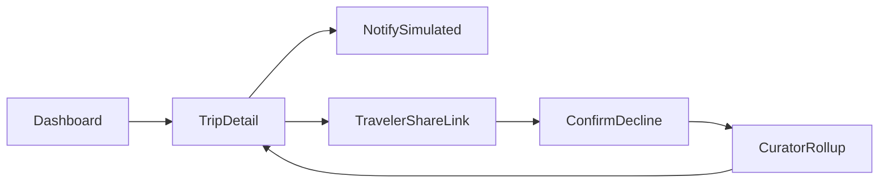
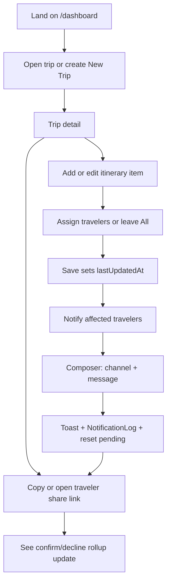
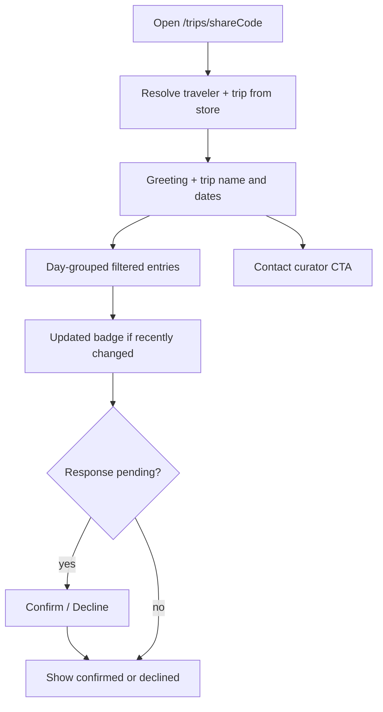

# 02 — User Flows

Frontend-only. Mutations live in the in-memory store for the browser session. Full reload may reset to seed JSON (acceptable for the mock).

## Roles

| Role | Access | Can do |
|---|---|---|
| **Curator** | `/dashboard`, `/dashboard/trips/:tripId` (assumed logged in) | Manage trips, itinerary, travelers, notify |
| **Traveler** | `/trips/:shareCode` (no login) | View filtered itinerary; confirm/decline |

## Core loop overview

## Curator flow

### Step-by-step

1. Land on `/dashboard` — see trip cards (name, destination, dates, counts, status).
2. Optionally search/filter; click **New Trip** → dialog (name, destination, dates) → create in store → navigate to new detail.
3. Open a trip (demo: `trip-1`) → `/dashboard/trips/trip-1`.
4. Review day-grouped itinerary; each entry shows type, time, location, assignment, rollup (e.g. `4/6 confirmed`).
5. **Add entry** or **Edit** — form fields: date, time, title, type (incl. `call-time`), location, notes, multi-select travelers (default all).
6. Saving an edit updates `lastUpdatedAt` on that item.
7. **Notify affected travelers** — composer shows who will be notified (assigned set, or all). Channels: Email and/or Telegram (UI only). Send → success toast; write `NotificationLog` rows; set those travelers’ `EntryResponse` for that item to `pending`.
8. In Travelers panel, copy share URL `/trips/{shareCode}` or open in new tab to preview.
9. After a traveler responds, return to trip detail — rollup badges update without a backend.

### Destructive / secondary actions

- Delete itinerary item or traveler → confirm dialog → optimistic remove + toast.
- Dashboard card Edit / Duplicate / Delete can stay toast-only or wire to store; prefer wiring New Trip + Delete for demo credibility.
- Settings / Logout in header → info toast only (out of scope).

## Traveler flow

### Step-by-step

1. Open `/trips/{shareCode}` (from curator copy link or demo shortcut).
2. If code unknown → friendly not-found (not a blank page).
3. See greeting: e.g. “Hi Marcus, here’s your itinerary for Sundance Film Festival 2026”.
4. See only entries where `assignedTravelerIds` is empty/missing **or** includes this traveler.
5. Entries with recent `lastUpdatedAt` (e.g. within 72 hours, or any with pending after notify) show an **Updated** badge.
6. If this traveler’s response is `pending` on a flagged/changed entry → **Confirm** / **Decline**.
7. After respond → show status; allow changing response (updates store + curator rollup).
8. Documents: view-only links if present on the trip.
9. **Contact curator** → `mailto:` to `currentUser.email` or toast with contact info.

## Demo path (rehearse before pitch)

1. `/dashboard` → open **Sundance** (`trip-1`).
2. Edit one call-time or flight → save.
3. Notify affected travelers → send.
4. Copy share link for Marcus (or open `/trips/...` seeded code).
5. Confirm the updated entry as traveler.
6. Back to trip detail → rollup shows confirmed count increased / pending decreased.

## Non-goals for flows

No login screens, no real message delivery, no persistence across devices, no multi-curator handoff.
